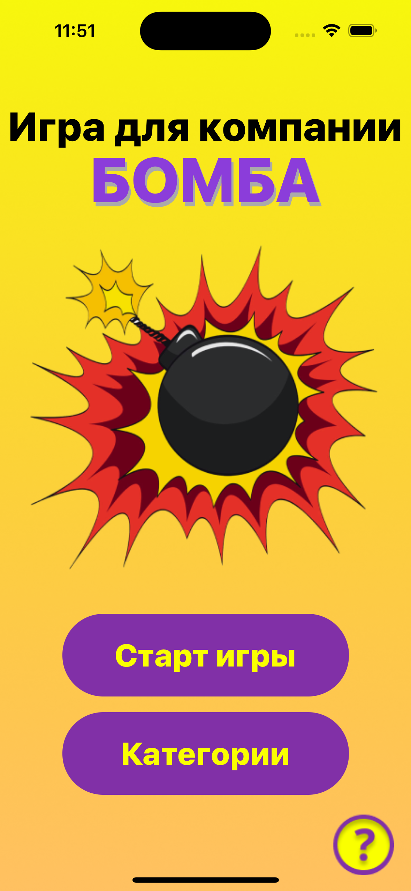
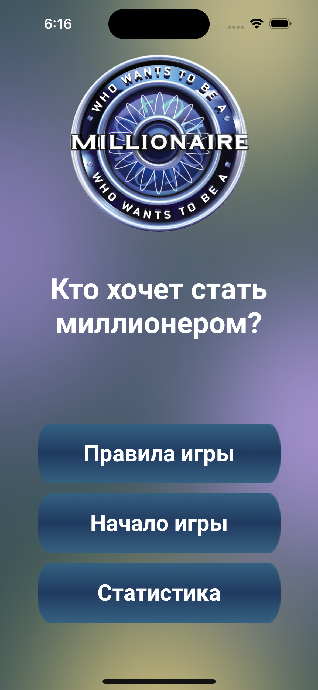

### Hi there 👋

#### DevRush Community - [Swift Marathon](https://t.me/devrush_community/13663)

|SM8 - team projects||| 
|:-|:-|:-|
|Игра для компании "Бомба"					        |Программа "Лучшие рецепты"                              ||
|[repository](https://github.com/s9888556/SM8Bomb) |[repository](https://github.com/s9888556/SM8BestRecipes)||
|        |          ||
|**SM11 - team projects**||| 
|Игра "Кто хочет стать миллионером?"		        |||
|[repository](https://github.com/s9888556/SM11WhoWantsToBeAMillionaire)|||
||||

 

<h2>Контакты 

<h3>
 

<!--
**s9888556/s9888556** is a ✨ _special_ ✨ repository because its `README.md` (this file) appears on your GitHub profile.

Here are some ideas to get you started:

- 🔭 I’m currently working on ...
- 🌱 I’m currently learning ...
- 👯 I’m looking to collaborate on ...
- 🤔 I’m looking for help with ...
- 💬 Ask me about ...
- 📫 How to reach me: ...
- 😄 Pronouns: ...
- ⚡ Fun fact: ...
-->
